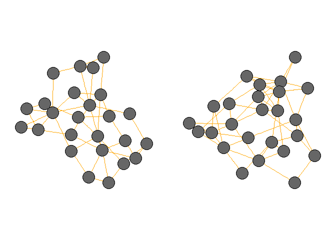
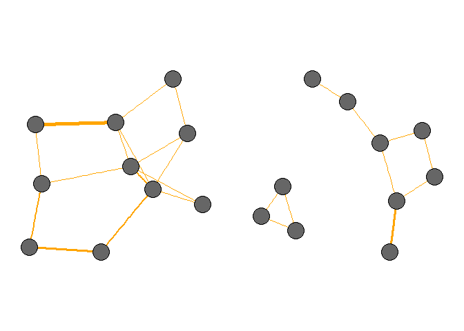

### Modeling social integration

This package contains models for simulating integration in social networks, and contains the following models:

**Social induction.**

This model reproduces the model introduced by Ilany and Akçay (2016). In this model incoming individuals form ties based on the parent node, and based whether other group members are connected to the parent node or not.

``` r
#Initial/observed network
startingNet = erdos.renyi.game(n=25, type = c("gnm"), p.or.m = 45)

#Simulate introductions and removals (i.e., iter)
predictedNet<-socialInduction(startingNet, Pn=0.4, Pr=0.1, Pb=1, iter=100)

#compare starting and ending network properties
par(mfrow=c(1,2), mar=c(1,1,1,1))
plot(startingNet,edge.color="orange", vertex.color="gray40", vertex.size = 20, layout=layout_with_fr, vertex.label=NA)
plot(predictedNet,edge.color="orange", vertex.color="gray40", vertex.size = 20, layout=layout_with_fr, vertex.label=NA)  
```



**Weighted Social Induction.**

This model simply extends the Ilany and Akçay (2016) model by including tie weights. This allows for effort to be taken into account.

``` r
#Initial/observed weighted network
startingNet = erdos.renyi.game(n=10, type = c("gnm"), p.or.m = 15)
E(startingNet)$weight<-c(2,25,1,1,1,1,4,5,6,9,2,1,2,1,2)

#Simulate introductions and removals
predWeightedNet<-socialInductionWeighted(startingNet, Pn=0.4,Pr=0.1,Pb=1,En1=0.1,En2=4,Er1=0.1,Er2=4,maxE=100,iter=100)

#compare starting and ending network properties
par(mfrow=c(1,2), mar=c(1,1,1,1))
plot(startingNet, edge.width=E(startingNet)$weight^0.5,edge.color="orange", vertex.color="gray40", vertex.size = 20, layout=layout_with_fr, vertex.label=NA)
plot(predWeightedNet, edge.width=E(predWeightedNet)$weight^0.5,edge.color="orange", vertex.color="gray40", vertex.size = 20, layout=layout_with_fr, vertex.label=NA)
```



### Reference:

Ilany, A. & Akçay, E. (2016) Social inheritance can explain the structure of animal social networks. Nature Communications, 7, 12084.
